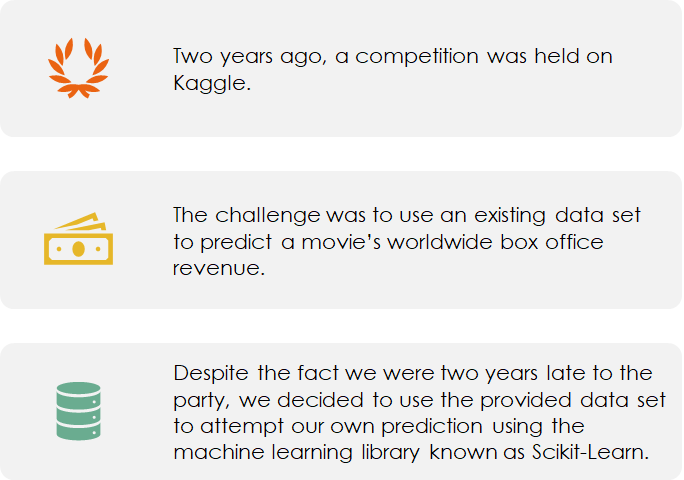
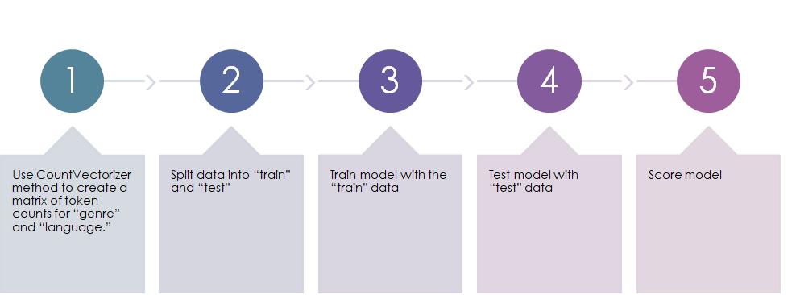

# Hollywood-ML

## Description
Machine Learning model to predict the gross receipts of a movie with given characteristics.
characteristics used are: 
* genre 
* language
* budget ($ USD)
* Release Month
* Duration (minutes)

### Background

### Initial Questions

### Process

